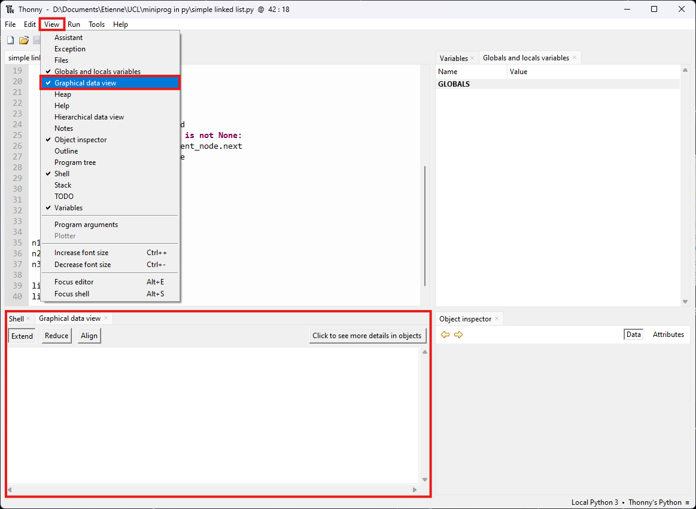
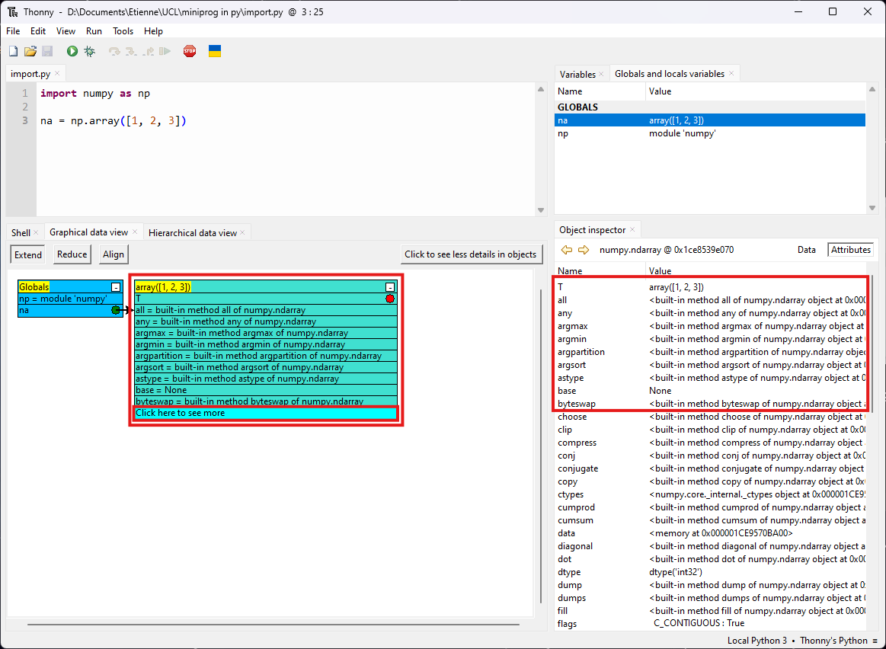

# Usage manual for the data visualization plug-in in Thonny

## Installation

1. Start by installing a version of Thonny greater than or equal to 4.1.4. Once you have done this, open Thonny. In the top left-hand corner, select the ‘Tools’ tab and click on ‘Manage plug-ins...’.

    

      
       
      <em>First installation step</em>
    

2. A window will now ask you to search for an extension. Type ‘Thonny-data-visualization’ in the search bar and press the ‘Search on Pypi’ button.
Select the first suggestion.

    

      
       
      <em>Second installation step</em>
    

3. Check that the version you are offered to install is the most recent (version 2.0.0 or higher). You can now install the extension by clicking on the ‘Install’ button.
You need to restart Thonny for the functions to be displayed. To do this, simply close it and reopen it. At the end of this step, you have installed our extension.

    

      
       
      <em>Third installation step</em>
    

## Using the globals and locals variables view

### In short :

1. In the View section, select Globals and locals variables
2. Run or debug your program to see your variables
3. Open the object inspector and see the details of your variables

### In details :

1. To display the local and global variables view, go to the ‘Views’ tab at the top left and select the ‘Globals and locals variables’ view. A new window will open on the right showing the global and local variables.

    

      
       
      <em>Opening the globals and locals variables view</em>
    

2. To view the global variables created in this program in the view, simply run the program by pressing the green button at the top left. The global variables, corresponding to the objects created in the program, appear in the view on the right.

    

      
       
      <em>Displaying globals variables</em>
    

3. Our view of global and local variables can be used in conjunction with Thonny's debugger. To do this, press the debug button at the top left and navigate through your program using the three arrows next to it. When you enter an instance, variables local to that instance will appear. In our view, they are distinguished from global variables by the title of the corresponding section.

    

      
       
      <em>Displaying globals and locals variables</em>
    

4. Our view of global and local variables works closely with Thonny's Object Inspector. So you can click on the line corresponding to a variable to see the details of its attributes and the memory address where it is stored. To do this, you need to have the ‘Object inspector’ view open and select the variable you want to explore in the local and global variables view. Then, to observe the attributes, simply click on the ‘Attributes’ button at the top right of the object inspector.

    

      
       
      <em>Using the locals and globals variables view with the object inspector</em>
    

## Using the hierarchical view

### In short :

1. In the View section, select Hierarchical data view
2. Run or debug your program
3. Use the + and - buttons to see the hierarchical representation of your different variables

### In details :

1. To use the hierarchical view, select ‘Hierarchical data view’ in the ‘Views’ tab. The hierarchical view will appear in the bottom left-hand window.

    

      
       
      <em>Opening the hierarchical view</em>
    

2. The first way to use our hierarchy view is simply to run the programme you want. To do this, simply press the green button in the top left-hand corner with the hierarchy view open.

    

      
       
      <em>Complete programme execution with hierarchical view</em>
    

3. The hierarchical view offers a simplified representation of variables which differs slightly from that of the global and local variables view. This representation adds a number as an identifier to the objects to make it easier to understand the correspondences and links between them. Thanks to this number, any user will easily understand which object refers to which other, because they will simply identify it by a common number.

    To give an example, we're going to browse the hierarchical view linked to Thonny's debugging tool. To do this, simply click on the debugger button at the top left, next to the run button. You can then move step by step through your programme using the adjacent arrows. When you enter an instance of the program, the section corresponding to the local variables of this instance will appear in the view. See the figure below.

    As in the rest of the view, if a local variable (or an attribute of an object) refers to an existing object as a global variable, then this will be indicated by a parenthesis including the name of the global variable being referred to. In the figure below, we can see that the local variable called ‘current_node’ currently corresponds to the ‘Node’ object called ‘n1’, which is a global variable. The parenthesis is therefore used to highlight local references (or attribute references) to global variables. For the rest, the identification number is used to understand the links between the objects.

    

      
       
      <em>Debugging the programme using the hierarchical view</em>
    

4. To view certain objects in greater detail, you can click on the small ‘+’ and ‘-’ buttons. When you do this, the various attributes of the object will appear. If one of these attributes also corresponds to an object, it is then possible to expand it again and view the attributes of the object in question.

    To understand the links between the attributes of one object and another, simply look at the number used as an identifier. If the number matches, then the variable corresponds to the object with that number. In the figure below, the local variable ‘current_node’ has been expanded. We can see that it corresponds to the ‘Node’ object number 1, which is also the global variable called ‘n1’. We can also see that the ‘head’ attribute of the ‘link’ global variable (which also corresponds to the ‘self’ local variable) is also linked to ‘Node’ object number 1.

    

      
       
      <em>Developing the hierarchical view</em>
    

5. In the case of imported variables, the hierarchical view proposes a different display. In fact, these variables tend to contain a large number of attributes which are not always of interest to the user, thus overloading the hierarchical view. To solve this problem, we don't display any attributes, but suggest that the user view them in the object inspector.

    To illustrate our point, we'll use a small Python program that simply initiates a list from the Numpy library. When we expand this list to view its attributes, a message is written instead suggesting that the user observe the details in the object inspector.

    

      
       
      <em>Imported variables in the hierarchical view</em>
    

6. Pour visualiser les attributs de la variable importée, il suffit de cliquer sur celle-ci dans la vue des variables locales et globales avec l'inspecteur d'objet ouvert. En faisant cela, elle apparaîtra dans ce dernier et il suffira alors de cliquer sur le bouton "Attributes" (ou "Attributs") pour afficher l'ensemble des attributs et pouvoir les parcourir.

    

      
       
      <em>Viewing an imported variable in the Object inspector</em>
    

## Using the graphical view

### In short :

1. In the View section, select Graphical data view
2. Run or debug your program
3. Use the little colored circles to see the links between your variables

- In this view you can move the different blocks and replace them by default with the Align button above
- You can also use the + and - buttons to see or hide details about your variables
- You can use the Extend and Reduce buttons to display or hide the details of all the variables
- You can use the button above on the right to allow the view to show more (or less) informations about your variables, especially the imported ones 

### In details :

1. To open the view, go back to the ‘Views’ tab and select ‘Graphical data view’. The view then opens in the bottom left-hand corner, in the same place as the hierarchical view.

    

      
       
      <em>Opening the graphical view</em>
    

2. As with the hierarchical views and the global and local variables, you can simply display the global variables by executing the entire program using the green button at the top right.

    

      
       
      <em>Complete programme execution with the graphical view</em>
    

3. Like the other views, the graphical view offers the most functionality and appeal when used with Thonny's debugger. To do this, press the button at the top left, next to the run button, and navigate through the program using the adjacent arrows. The program's global and local variables will then appear in the corresponding sections. In blue for global variables and in green for local variables.

    

      
       
      <em>Debugging the programme using the graphical view</em>
    

4. To see what the different variables correspond to, press the small red dots in front of the variable names. These dots will then turn green to indicate that the object is displayed. An arrow will then appear to indicate the correspondence between the name of the variable or attribute and the object to which it relates. When several variables or attributes relate to the same object, the different arrows will point to the same box corresponding to that object.

    The representation chosen to identify the various objects and variables has been simplified and is slightly different from those used in hierarchical views and global and local variables. Variables are identified here only by the highlighted line indicating their type in the case of objects (e.g. ‘Node’ or ‘LinkedList’), and also for data structures native to Python (such as ‘list’, ‘dict’ or ‘set’). Other variables that do not need to be expanded, because they have no attributes or elements, have their name equalised to their value on the same line (for example ‘i = 5’ or ‘c = “Hello world”’).

    

      
       
      <em>Developing the graphical view</em>
    

5. Using the small ‘-’ buttons, you can reduce the size of object boxes so that only the highlighted line representing the object is displayed. This reduces the size of the boxes, making them easier to read and saving space. Click on the ‘Reduce’ button at the top left of the graphical view to reduce the size of all the boxes at once. See the figure below.

    You can then expand a reduced box by pressing the ‘+’ button. You can also extend all the boxes at once by clicking on the ‘Extend’ button.

    

      
       
      <em>Reducing boxes in the graphical view</em>
    

6. Sometimes, when objects are expanded, extended or reduced, they overlap or gaps are created. To bring all the boxes back into compact alignment, you can click on the ‘Align’ button. This will have the effect of returning each box to its default position, relatively glued and aligned, with no overlap. From here, it becomes easier to reposition the boxes by dragging them with the mouse.

    

      
       
      <em>Aligning boxes in the graphical view</em>
    

7. In the same way as with the hierarchical view, imported variables are treated differently from other variables in the graphical view. Taking the code example used with the hierarchical view and importing lists from the Numpy library, the graphical view will also display a message suggesting that the user view the attributes of the imported variable in the object inspector, instead of displaying them directly. Once again, this is done to simplify the view and avoid clutter with numerous attributes that are not always interesting.

    As in the hierarchical view, it is possible to observe the various attributes of the imported variable by selecting it in the local and global variables view with the object inspector open. The inspector then displays details of the variable in question, including its attributes if you click on the ‘Attributes’ button at the top right of the inspector window.

    

      
       
      <em>Imported variables in the hierarchical view</em>
    

8. Unlike the hierarchical view, here you can choose to view the various attributes of the imported variables directly in the global view. To do this, first click on the ‘Click to see more details in objects’ button at the top right of the graphical view (see previous figure). The message will then ask you to run the program again to view all the objects and their attributes. This can be done simply by pressing the run button at the top right again, or by debugging the program using the button next to it.

    

      
       
      <em>Viewing the attributes of imported variables in the graphical view</em>
    

9. When this is done, the graphical view will display some of the attributes of the imported variable. To avoid overloading the view, we have chosen to display only 10 attributes or elements at a time. However, users can click on the ‘Click here to see more’ button in light blue at the end of a box to display the next 10 attributes or elements. It is of course possible to click on the button several times to view the next 10 attributes or elements, etc, until the last attribute or element is displayed.

    It is also possible to go back and hide the cumbersome attributes of the imported variables. To do this, simply click again on the button at the top right of the graphical view, which is now entitled ‘Click to see less details in objects’. You will need to run the program again or debug it to display the objects in a simplified way.

    

      
       
      <em>Display of the top 10 attributes in the graphical view</em>
    

    

      
       
      <em>Display of the following 10 attributes in the graphical view</em>
    
